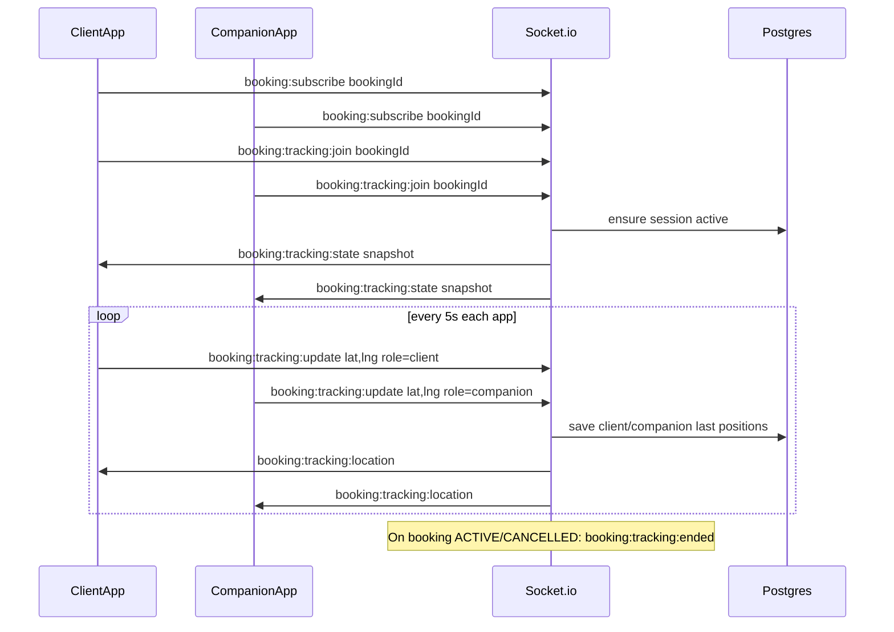

# Live booking tracking — implementation plan (Phase 1)

**Product model (confirmed):** **Uber / InDrive style — both client and companion share live GPS and both see each other on the map** (two moving pins + meeting point).

Design reference: map with route, ETA, distance, progress — each side sees **self + other person + destination**.

**Status:** Phase 1 **implemented** (sockets + REST). Run migration `20261001193000_booking_live_tracking`. See **`docs/BOOKING_SOCKETS.md` §14**.

---

## 1. What each app shows

| UI element | Source |
|------------|--------|
| **Meeting pin** | Booking `latitude`, `longitude`, `address` |
| **Companion pin** | Live stream: `companion` lat/lng |
| **Client pin** | Live stream: `client` lat/lng |
| **Route lines** | Mobile **Directions** (each app: other person → meeting, or self → meeting — product choice on UX) |
| **“Arriving in X mins” / “X mi away”** | Mobile Directions **or** server rough ETA between **other person** and **meeting point** (and optionally **distance between client & companion**) |
| **Progress bar** | Client-side math from distances when session starts |

**Both roles** use the same tracking session for the same `bookingId`; layout/copy differs (client sees “Companion is 1.4 mi away”, companion sees “Client is …”).

---

## 2. What we already have

| Piece | Status |
|-------|--------|
| Meeting location on booking | `Booking.latitude`, `longitude`, `address` |
| Socket auth + `booking:{id}` room | `booking:subscribe` |
| Distance helper | `calculateDistance` in `src/utils/methods.ts` |
| Chat one-shot location | `location_shared` in messaging (not live) |
| Live bidirectional tracking | **Built** — sockets + REST (§6–7) |

---

## 3. Product rules (Uber-like)

1. **Who shares:** **Both** client and companion on that booking (each device sends its own GPS).
2. **Who views:** **Both** — same live session; each sees the other’s latest position (+ self on map).
3. **When live tracking is allowed:** Booking **`ACCEPTED`** (same as messaging until payment module is live).  
   - **Stop (recommended MVP):** when status becomes **`ACTIVE`** (meetup started via OTP/start flow), **`COMPLETED`**, or **`CANCELLED`**.  
   - *Optional later:* continue through **`ACTIVE`** until **`COMPLETED`** (full ride-hailing parity) — confirm with PM.
4. **How it starts:** Opening the **live map screen** (or explicit “Share location”) on either side joins the session; **both must grant location permission** to publish (viewer can still open map to see other if only one is sharing — show “Waiting for location…”).
5. **Update rate:** Each user ≤ 1 update / **3–5 seconds** per booking (server rate limit per `userId`).
6. **Privacy:** Positions only for participants on that booking; never on discover/feed/public APIs.

---

## 4. Architecture



**Transport:** Socket.io primary; REST snapshot for cold start / reconnect.

---

## 5. Database (MVP)

On **`Booking`** (or one row per booking in `BookingLiveTracking`):

| Field | Purpose |
|-------|---------|
| `trackingSessionActive` | Session on for this booking |
| `trackingStartedAt` | DateTime? |
| `clientLastLat`, `clientLastLng`, `clientLastTrackedAt` | Client position |
| `companionLastLat`, `companionLastLng`, `companionLastTrackedAt` | Companion position |
| optional `clientSharing`, `companionSharing` | boolean — user joined / publishing |
| optional heading/accuracy per side | Map rotation |

No ping history in Phase 1 unless support needs it.

---

## 6. Socket events

### Client → server (either participant, must be on booking)

| Event | Payload |
|-------|---------|
| `booking:tracking:join` | `{ bookingId }` — user enters map / agrees to share |
| `booking:tracking:update` | `{ bookingId, latitude, longitude, heading?, accuracy? }` — server sets role from auth (client vs companion) |
| `booking:tracking:leave` | `{ bookingId }` — stop publishing (optional; session may stay for other user) |

### Server → clients (room `booking:{id}` + both `user:{id}` rooms)

| Event | Payload |
|-------|---------|
| `booking:tracking:state` | Full snapshot after join/reconnect |
| `booking:tracking:location` | `{ bookingId, role: 'client' \| 'companion', userId, latitude, longitude, updatedAt, … }` |
| `booking:tracking:ended` | `{ bookingId, reason }` — session closed (booking status, etc.) |

**`booking:tracking:state` example:**

```json
{
  "bookingId": 12,
  "sessionActive": true,
  "meeting": { "latitude": 25.1, "longitude": 55.2, "address": "…" },
  "client": { "userId": 1, "sharing": true, "latitude": 25.11, "longitude": 55.21, "updatedAt": "…" },
  "companion": { "userId": 2, "sharing": true, "latitude": 25.09, "longitude": 55.19, "updatedAt": "…" }
}
```

Server may add **`distanceToMeetingKm`** / **`distanceBetweenKm`** / rough **`etaMinutes`** per role for fallback UI.

---

## 7. REST (recommended)

| Method | Path | Purpose |
|--------|------|---------|
| GET | `/api/booking/:id/tracking` | Same snapshot as `tracking:state` (app launch / polling fallback) |
| POST | `/api/booking/:id/tracking/join` | HTTP alternative to socket join |
| POST | `/api/booking/:id/tracking/leave` | Stop sharing for current user |

Auth: same as booking detail — only client + companion on that booking.

---

## 8. Hooks into existing booking flows

| Action | Tracking |
|--------|----------|
| `POST /api/booking/start/:id` → **ACTIVE** | End session → `booking:tracking:ended` (unless PM extends into ACTIVE) |
| Cancel / complete | End session |
| Push (optional) | “Client/Companion is sharing location” when other joins |

---

## 9. Mobile (both apps)

| Task | Client app | Companion app |
|------|------------|---------------|
| Permission + GPS loop | Yes | Yes |
| `booking:subscribe` + `tracking:join` | Yes | Yes |
| Emit `tracking:update` | Yes | Yes |
| Listen `tracking:location` / `state` | Yes | Yes |
| Map: 2 pins + meeting | Yes | Yes |
| ETA copy toward **other user** or **meeting** | Product copy | Product copy |

Backend does **not** render the map or polyline in Phase 1.

---

## 10. Security

- Updates only from **clientId** or **companion userId** for that booking.
- Valid booking status + paid gate before join/update.
- Rate limit per user per booking.
- Validate lat/lng.

---

## 11. Implementation order (backend)

1. Prisma migration (fields in §5).
2. `src/utils/bookingTracking.ts` — gates, snapshot builder, haversine helpers, `endTrackingSession(bookingId, reason)`.
3. `src/sockets/trackingHandlers.ts` — join / update / leave.
4. `src/controllers/user/tracking.ts` (or booking) — GET/POST REST.
5. Call `endTrackingSession` from start/cancel/complete booking.
6. `docs/BOOKING_SOCKETS.md` + Swagger.

---

## 12. Still to confirm (minor)

1. Stop tracking at **`ACTIVE`** only, or keep until **`COMPLETED`**?
2. Auto-**join** when opening map vs separate “Share location” button?
3. Push when the **other person** starts sharing?

**Resolved:** Both see both — **bidirectional**, Uber/InDrive style.

When you want to build, say **go Phase 1** and we implement §11.
