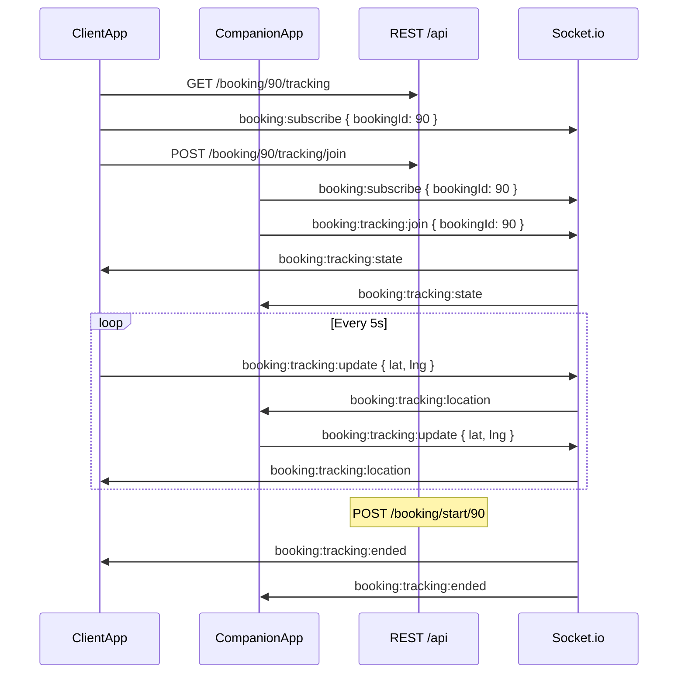

# Live booking tracking — frontend integration guide (Phase 1)

**Give this file to Cursor / your mobile developer.** It contains product rules, **REST URLs**, **Socket.io events**, and copy-paste JSON so the map screen can be built without digging through the backend repo.

**Product model:** **Uber / InDrive style** — **both** client and companion share live GPS; **both** see two moving pins + the **meeting point** on the map.

**Backend status:** Implemented (REST + sockets). DB migration: `20261001193000_booking_live_tracking` (and related). OpenAPI: **`swagger-mobile.json`** → paths `/booking/{id}/tracking`, `/join`, `/leave`. More socket context: **`docs/BOOKING_SOCKETS.md` §14**.

---

## Quick start (Flutter checklist)

1. User logged in → connect **Socket.io** with same JWT as REST (`path: /socket.io`, `auth: { token }`).
2. Booking must be **`ACCEPTED`** (companion accepted; payment not required for MVP).
3. Open live map for `bookingId`:
   - **`GET /api/booking/detail/:id`** — meeting `latitude`, `longitude`, `address` (if not in tracking snapshot).
   - **`GET /api/booking/:id/tracking`** — cold-start snapshot **or**
   - **`POST /api/booking/:id/tracking/join`** — start sharing (also broadcasts state).
4. **`socket.emit('booking:subscribe', { bookingId })`** — join booking room (messages + tracking).
5. **`socket.emit('booking:tracking:join', { bookingId })`** — if not using REST join.
6. Start GPS loop (~every **5 s**, min **3 s** apart): **`booking:tracking:update`** with `{ bookingId, latitude, longitude, heading?, accuracy? }`.
7. Listen: **`booking:tracking:state`**, **`booking:tracking:location`**, **`booking:tracking:ended`**, **`booking:tracking:error`**.
8. On leave map: **`POST .../tracking/leave`** and/or **`booking:tracking:leave`**.
9. When session starts (**`POST /api/booking/start/:id`** → `ACTIVE`), expect **`booking:tracking:ended`** — tear down map/GPS.

**Not live tracking:** predefined chat **`location_shared`** in messaging — one-shot pin only.

---

## 1. Three map pins (required UI)

The live map always has **three logical locations**. The backend sends all three in every **`GET /tracking`**, **`booking:tracking:state`**, and after join:

| Pin | `pinId` / `kind` | Static or live | Where coordinates come from |
|-----|------------------|----------------|-----------------------------|
| **Booking / meeting place** | `meeting` | **Static** (set at book time) | `Booking.latitude`, `longitude`, `address` → `data.meeting` |
| **Client** | `client` | **Live GPS** | `data.client` + `booking:tracking:location` when `role === "client"` |
| **Companion** | `companion` | **Live GPS** | `data.companion` + `booking:tracking:location` when `role === "companion"` |

### Easiest Flutter approach: `data.markers`

The API includes **`markers`** — always **3 entries** (`meeting`, `client`, `companion`):

```dart
for (final pin in data.markers) {
  if (!pin.visible || pin.latitude == null) continue; // live pins appear after first GPS
  map.addMarker(MarkerId(pin.pinId), LatLng(pin.latitude!, pin.longitude!), title: pin.label);
}
```

- **Meeting pin:** show when `meeting.hasCoordinates === true` (usually always after booking).
- **Client / companion pins:** `visible: false` until that user joins and sends at least one **`booking:tracking:update`** (or REST join + GPS). Show placeholder copy: “Waiting for client/companion location…” when `sharing: true` but lat is null.

You can also use **`data.meeting`**, **`data.client`**, **`data.companion`** directly (same coordinates as `markers`).

| UI element | Source |
|------------|--------|
| **Route / polyline** | **Mobile** Google/Apple Directions (backend does not draw routes) |
| **ETA / distance text** | `distanceToMeetingKm`, `etaToMeetingMinutes` per participant **or** Directions |
| **Distance between users** | `distanceBetweenKm` |

**If meeting pin is missing:** booking was created without `latitude`/`longitude` — fix data or use `GET /api/booking/detail/:id`; tracking still returns `meeting.hasCoordinates: false`.

---

## 2. When tracking is allowed

| Rule | Value |
|------|--------|
| **Allowed** | Booking `status === ACCEPTED` |
| **Blocked** | `PENDING`, `CANCELLED`, `COMPLETED`, and after **`ACTIVE`** (session started) — session ends |
| **Who can call APIs** | Only the booking **client** (`clientId`) or **companion** (companion profile on that booking) |
| **Update rate** | Server enforces ≥ **3 seconds** between updates per user per booking |
| **Privacy** | Never exposed on discover/feed/public APIs |

---

## 3. REST API reference

**Base URL:** `{BASE_URL}/api` (e.g. `https://your-host.com/api` or `http://localhost:3000/api`)

**Auth (all endpoints below):**

```http
Authorization: Bearer <JWT>
```

Replace `{bookingId}` with the numeric booking id (e.g. `90`).

### 3.1 Get tracking snapshot

```http
GET /api/booking/{bookingId}/tracking
```

**Body:** none

**200 — `data` shape** (same as socket `booking:tracking:state`):

```json
{
  "status": true,
  "data": {
    "bookingId": 90,
    "sessionActive": true,
    "allowed": true,
    "reason": null,
    "meeting": {
      "latitude": 33.565,
      "longitude": 73.152,
      "address": "Soan Gardens Islamabad, Pakistan",
      "hasCoordinates": true
    },
    "markers": [
      { "pinId": "meeting", "kind": "meeting", "label": "Soan Gardens…", "latitude": 33.565, "longitude": 73.152, "isLive": false, "visible": true },
      { "pinId": "client", "kind": "client", "userId": 228, "label": "Client", "latitude": 33.566, "longitude": 73.153, "isLive": true, "sharing": true, "visible": true },
      { "pinId": "companion", "kind": "companion", "userId": 239, "label": "Companion", "latitude": null, "longitude": null, "isLive": true, "sharing": false, "visible": false }
    ],
    "client": {
      "role": "client",
      "userId": 228,
      "sharing": true,
      "latitude": 33.566,
      "longitude": 73.153,
      "updatedAt": "2026-10-02T12:00:00.000Z",
      "distanceToMeetingKm": 0.12,
      "etaToMeetingMinutes": 1
    },
    "companion": {
      "role": "companion",
      "userId": 239,
      "sharing": false,
      "latitude": null,
      "longitude": null,
      "updatedAt": null,
      "distanceToMeetingKm": null,
      "etaToMeetingMinutes": null
    },
    "distanceBetweenKm": null
  }
}
```

| Error | When |
|-------|------|
| `400` | Invalid booking id |
| `403` | Not client/companion on this booking |
| `404` | Booking not found |

If `allowed: false`, show `reason` and disable join/GPS (e.g. not accepted yet).

---

### 3.2 Join session (start sharing)

```http
POST /api/booking/{bookingId}/tracking/join
Content-Type: application/json
```

**Body:** empty `{}` or no body.

**200:**

```json
{
  "status": true,
  "msg": "Joined live tracking",
  "data": { }
}
```

(`data` = full **`BookingLiveTrackingState`** object, same as GET tracking.)

Also emits **`booking:tracking:state`** to both participants on socket.

| Error | When |
|-------|------|
| `400` | Invalid id / tracking not allowed (`code` may be present) |
| `403` | Not a participant |

---

### 3.3 Leave session (stop sharing)

```http
POST /api/booking/{bookingId}/tracking/leave
```

**Body:** empty.

**200:**

```json
{
  "status": true,
  "msg": "Left live tracking",
  "data": { }
}
```

Updates `client.sharing` or `companion.sharing` to `false` for the caller; broadcasts updated state on socket.

---

### 3.4 Related REST (not tracking, but needed for map)

| Method | Path | Use |
|--------|------|-----|
| GET | `/api/booking/detail/{bookingId}` | Full booking; meeting coords; client OTP on detail for client when `ACCEPTED`/`ACTIVE` |
| GET | `/api/booking/home-bar` | Feed blue bar 30 min before start (optional entry to map) — see **`docs/BOOKING_SOCKETS.md` §15** |

---

## 4. Socket.io reference

### 4.1 Connect

```javascript
import { io } from 'socket.io-client';

const socket = io('https://YOUR_API_HOST', {
  path: '/socket.io',
  auth: { token: userJwt },
});
```

On connect, server auto-joins `user:{userId}` (and `companion:{profileId}` if applicable).

### 4.2 Client → server (emit)

| Event | Payload | When |
|-------|---------|------|
| `booking:subscribe` | `{ "bookingId": 90 }` | Enter booking screen / map (required for room delivery) |
| `booking:unsubscribe` | `{ "bookingId": 90 }` | Leave screen |
| `booking:tracking:join` | `{ "bookingId": 90 }` | Same as REST join (alternative) |
| `booking:tracking:update` | See below | Every ~5 s while sharing |
| `booking:tracking:leave` | `{ "bookingId": 90 }` | Stop sharing |

**`booking:tracking:update` example:**

```json
{
  "bookingId": 90,
  "latitude": 33.5650275,
  "longitude": 73.1522898,
  "heading": 180,
  "accuracy": 12.5
}
```

Server determines **client vs companion** from JWT — do **not** send `role` in the payload.

### 4.3 Server → client (listen)

| Event | Purpose |
|-------|---------|
| `booking:tracking:state` | Full snapshot (after join, leave, REST join, reconnect) |
| `booking:tracking:location` | Single position update after someone's `tracking:update` |
| `booking:tracking:ended` | Session closed — `{ "bookingId", "reason" }` |
| `booking:tracking:error` | Join/update failed — `{ "bookingId", "msg", "code?" }` |

**`booking:tracking:location` example:**

```json
{
  "bookingId": 90,
  "role": "companion",
  "userId": 239,
  "latitude": 33.564,
  "longitude": 73.151,
  "heading": null,
  "accuracy": 10,
  "updatedAt": "2026-10-02T12:00:05.000Z",
  "distanceToMeetingKm": 0.2,
  "etaToMeetingMinutes": 1,
  "distanceBetweenKm": 0.15
}
```

Apply updates: if `role === "client"`, move client pin; if `"companion"`, move companion pin.

---

## 5. End-to-end flow (sequence)



---

## 6. Postman smoke test

1. Login → save JWT.
2. Ensure booking **90** is **ACCEPTED** (`GET /api/booking/detail/90`).
3. **Client token:** `POST /api/booking/90/tracking/join` (no body).
4. **Companion token:** same join.
5. `GET /api/booking/90/tracking` — both sides should show `sharing: true` after join.
6. For movement, use Socket.io client or app; REST alone does not send GPS.
7. `POST /api/booking/90/tracking/leave` when done.

---

## 7. Backend hooks (when UI should react)

| User / server action | Tracking effect |
|----------------------|-----------------|
| `POST /api/booking/start/:id` → **ACTIVE** | Tracking ends → `booking:tracking:ended` |
| Cancel booking | Tracking ends |
| Auto-complete after `endTime` (cron) | Status **COMPLETED** → bar/tracking refresh |

---

## 8. Database fields (reference)

On **`Booking`:**

| Field | Purpose |
|-------|---------|
| `trackingSessionActive` | Session on for this booking |
| `trackingStartedAt` | When session started |
| `clientLastLat/Lng`, `clientLastTrackedAt` | Last client GPS |
| `companionLastLat/Lng`, `companionLastTrackedAt` | Last companion GPS |
| `clientSharing`, `companionSharing` | User joined / publishing |

---

## 9. Security (backend enforced)

- GPS updates only from **clientId** or **companion userId** for that booking.
- **`ACCEPTED`** gate before join/update (no payment check in MVP).
- Rate limit ≥ **3 s** between updates per user per booking.
- Lat/lng validated (−90…90, −180…180).

---

## 10. Backend source map (for Cursor in this repo)

| Area | Path |
|------|------|
| REST controllers | `src/controllers/user/tracking.ts` |
| Routes | `src/routes/user/booking.ts` |
| Socket handlers | `src/sockets/trackingHandlers.ts` |
| Session + DB updates | `src/utils/bookingTrackingSession.ts` |
| Snapshot builder | `src/utils/bookingTracking.ts` |
| Emit helpers | `src/sockets/bookingEmit.ts` |
| OpenAPI | `swagger-mobile.json` — schemas `BookingLiveTrackingStateDto`, `BookingTrackingParticipantDto` |

---

## 11. Open product questions (optional later)

1. Keep tracking during **`ACTIVE`** until **`COMPLETED`**?
2. Auto-join on map open vs explicit “Share location”?
3. Push when the other person starts sharing?

**Resolved:** Bidirectional map for client + companion (Uber/InDrive style).
